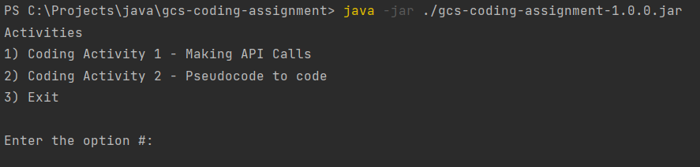

# How to run

### Option 1
- Go to root project directory and execute in the command-line:  
<Code>'java -jar ./gcs-coding-assignment-1.0.0.jar'</Code>

### Option 2
- Open project up in IDE and run the 'Main' class

After that, navigate the activities through command-line

